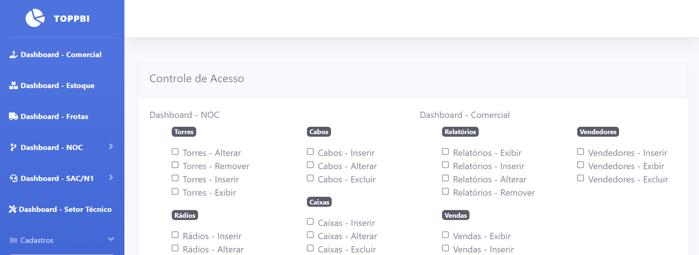
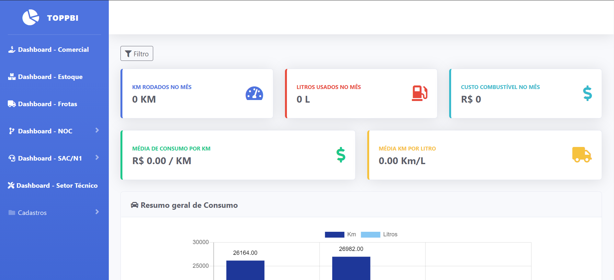
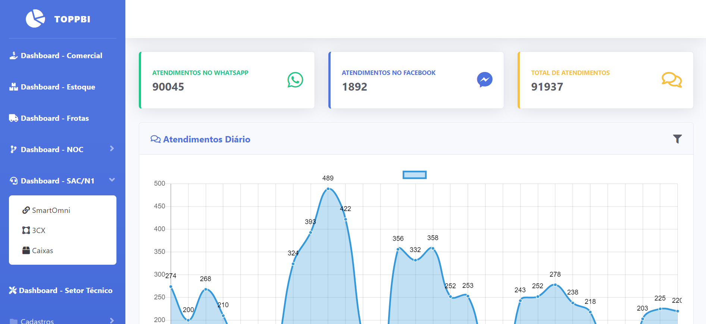
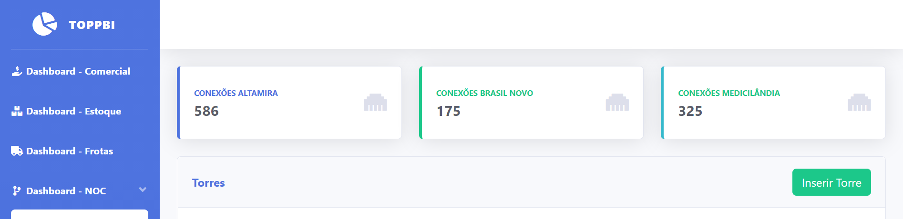
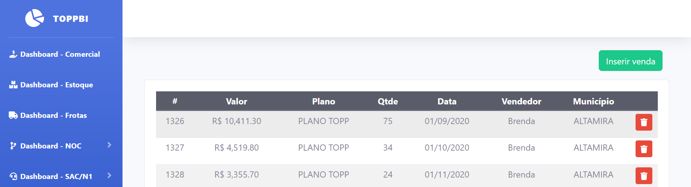

## TOPPBI
O ToppBI é um sistema projetado para gestores gerenciar seus relatórios e gerar gráficos e projeções para ter uma noção do que se passa pela seu provedor. Algumas de suas principais funções são:

- Dashboard da área comercial (Vendas)
    - Relatório de vendas por vendedor
    - Relatório de planos vendidos
    - Relatório de planos mais vendidos
    - Relação mensal de vendas por vendedora
    - Relatório de vendas por município
- Dashboard de Frotas
    - Relatório de Carros
    - Relatorio de consumo de combustível
    - Relatório de quilometragem
- Dashboard de operações de rede
    - Relatório de operadoras
    - Relatório de incidentes por operadora
    - Relatório geral de indisponibilidade
- Dashboard de torres
    - Relação de Torres
    - Relação de rádios conectados por torre
    - Relação geral dos equipamentos na torre
    - Relatório de clientes conectados
    - Total gasto por torre
    - Inserir imagens da torre e seus equipamentos
- Dashboard de SAC
    - Relatório de atendimento
    - Relação de atendimentos via Whatsapp
    - Relação de atendimentos via Mensenger
    - Relação de atendimentos via Telefone
    - Relatório de atendimento por agente
    - Gráfico de atendimentos diários
- Cadastros
    - Planos
    - Vendedores
    - Usuários
    - Equipes
    - Setores

#### Algumas telas do sistema
- Controle de Acesso

 
- Dashboard Frota

 
- Dashboard SAC

 
- Dashboard Torres

 
- Dashboard Comercial
